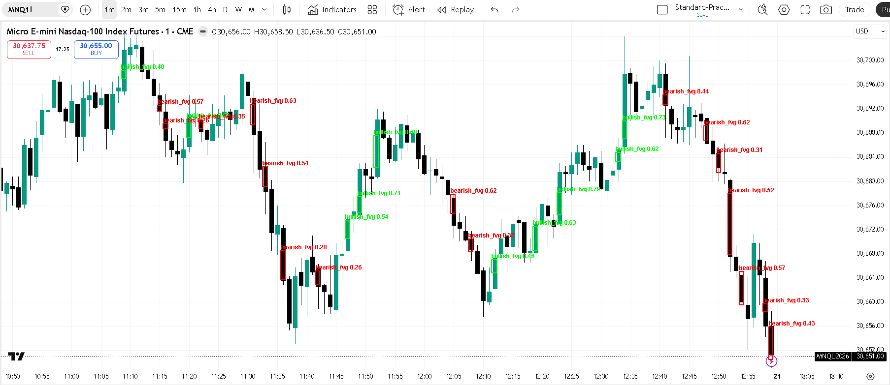

# Market Structure CV — NQ Fair Value Gap Detector

A full end-to-end computer vision pipeline that detects **Fair Value Gaps (FVGs)**. It is an ICT (Inner Circle Trader) price action concept on **NQ Micro E-mini Nasdaq-100 Futures** charts using YOLO object detection.

> **92.3% mAP@50** on unseen test data | Trained on 280 screenshots | 2,000+ annotated instances



---

## 🔍 What is a Fair Value Gap?

A Fair Value Gap is a 3-candle price inefficiency created by a strong impulse move. A gap exists between the wick of candle 1 and the wick of candle 3:

- 🟢 **Bullish FVG** gap created during an upward impulse move 
- 🔴 **Bearish FVG** gap created during a downward impulse move 

---

##  Project Structure

```
market-structure-cv/
├── api/
│   ├── main.py              ← FastAPI app, middleware, model loading
│   ├── routes.py            ← API endpoints
│   └── schemas.py           ← Pydantic request/response models
├── inference/
│   └── live_inference.py    ← Live screen overlay (personal use)
├── models/
│   └── weights/             ← Model weights (not tracked in git)
├── data/
│   ├── raw/                 ← Raw screenshots (not tracked in git)
│   └── resized/             ← Resized screenshots (not tracked in git)
├── notebooks/
│   └── train.ipynb          ← Training pipeline
├── scripts/
│   └── resize.py            ← Image preprocessing
├── app.py                   ← Gradio UI
├── main.py                  ← Personal entry point (live overlay)
├── config.yaml              ← All configuration
├── Dockerfile
├── docker-compose.yml
└── requirements.txt
```

---

## Model Performance

Four models were trained and compared:

| Model | Epochs | mAP@50 | mAP@50-95 | Precision | Recall | F1 |
|-------|--------|--------|-----------|-----------|--------|----|
| YOLO26n | 100 | 87.3% | 49.8% | 83.6% | 81.9% | — |
| YOLOv11n | 100 | 91.5% | 54.3% | 87.5% | 88.6% | — |
| YOLOv11m | 100 | 93.4% | 57.0% | 90.1% | 88.8% | 85.6% |
| YOLO26m | 80 | 93.3% | 56.7% | 86.7% | 91.9% | 86.6% |

### Final Model — YOLO26m (Test Set)

| Metric | Score |
|--------|-------|
| mAP@50 | **92.3%** |
| mAP@50-95 | 58.2% |
| Precision | 83.9% |
| Recall | **89.4%** |
| F1 | 86.6% |

> YOLO26m was selected over YOLOv11m due to superior mAP@50 and Recall on the unseen test set, and a smaller generalization gap between validation and test.

---

## Quick Start

### 1. Clone the repo
```bash
git clone https://github.com/ibtsamsadiq/market-structure-cv.git
cd market-structure-cv
```

### 2. Install dependencies
```bash
pip install -r requirements.txt
```

### 3. Download model weights
Download `best.pt` from [HuggingFace](https://huggingface.co/ibtsamsadiq/nq-fvg-detector) and place it in:
```
models/fvg_detector/weights/best.pt
```

### 4. Update config
Edit `config.yaml` to set your model path and screen region.

---

## Usage

### Live Screen Overlay (Personal Use)
Runs a transparent overlay on top of TradingView that detects FVGs in real time:
```bash
python main.py
```
- Press **F2** to trigger detection
- Press **F3** to quit
- Auto-refreshes every 4 seconds

### Gradio UI
Interactive web UI for uploading chart screenshots:
```bash
python app.py
```
Opens at `http://localhost:7860`

### FastAPI Endpoint
```bash
cd api
uvicorn main:app --reload
```
Opens at `http://localhost:8000/docs`

**Predict endpoint:**
```bash
curl -X POST "http://localhost:8000/predict" \
  -H "accept: application/json" \
  -F "file=@chart.png"
```

**Response:**
```json
{
  "detections": [
    {
      "cls": "bullish_fvg",
      "confidence": 0.87,
      "bbox": {"x1": 120, "y1": 340, "x2": 145, "y2": 390}
    }
  ],
  "total_detections": 1,
  "bullish_count": 1,
  "bearish_count": 0,
  "inference_time_ms": 42.3
}
```

---

## Docker

```bash
# Build and run
docker-compose up --build

# Run detached
docker-compose up -d

# Stop
docker-compose down
```

API available at `http://localhost:8000`

---

## Dataset

- **Instrument:** NQ1! (Micro E-mini Nasdaq-100 Futures)
- **Timeframes:** 1m, 5m
- **Total images:** 295 screenshots
- **Total instances:** ~2,400+ annotated FVGs
- **Split:** 70% train / 15% val / 15% test
- **Annotation tool:** Roboflow
---

## Training

Full training pipeline in `notebooks/train.ipynb`.

```python
from ultralytics import YOLO

model = YOLO("yolo26m.pt")

model.train(
    data="data/dataset/nq-fvg-dataset/data.yaml",
    epochs=100,
    imgsz=640,
    batch=16,
    patience=20,
    optimizer="auto",
    pretrained=True,
)
```

---

## Links

| Resource | Link |
|----------|------|
| 🤗 Model on HuggingFace | [ibtsamsadiq/nq-fvg-detector](https://huggingface.co/ibtsam/nq-fvg-detector) |
| 📦 Dataset on Kaggle | [ibtsamsadiq/nq-fvg-dataset](https://www.kaggle.com/datasets/ibtsamsadiq/nq-fvg-dataset) |
| Live Demo | [HuggingFace Spaces](https://huggingface.co/spaces/ibtsam/nq-fvg-detector) |

---

## Limitations

- Trained on white background TradingView charts only
- NQ1! futures instrument only
- Performance may degrade on different zoom levels or chart themes
- FVG annotation is subjective — model reflects one consistent annotation style

---

## License

This project uses [AGPL-3.0](LICENSE) in compliance with Ultralytics YOLO licensing.

---

## Author

**Ibtsam Sadiq**: AI/ML Engineer

[](https://www.linkedin.com/in/ibtsamsadiq01)
[](https://huggingface.co/ibtsam)

> **Disclaimer:** This project is for research and educational purposes only. Not financial advice.